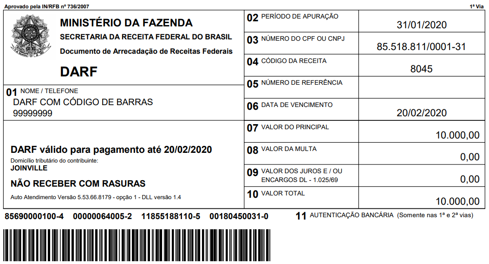

# Boleto Winner

[](https://packagist.org/packages/claudsonm/boleto-winner)
[](https://github.com/claudsonm/boleto-winner/actions?query=workflow%3ACI+branch%3Amaster)
[](https://scrutinizer-ci.com/g/claudsonm/boleto-winner/?branch=master)
[](https://scrutinizer-ci.com/g/claudsonm/boleto-winner/?branch=master)

Pacote para validar, converter e obter dados contidos nos códigos de barra de
boletos e convênios.

## Nomenclaturas

### Boleto vs Convênio

Uma conta de convênio (também conhecida como "conta de
concessionária") geralmente é emitida por concessionárias de serviço, como no
caso de grande parte das contas de energia elétrica, de telefonia, de gás,
dentre outras. Podem ainda ser oriundas de órgãos governamentais, como
acontece com o DAS (Documento de Arrecadação do Simples Nacional),
DARF (Documento de Arrecadação de Receitas Federais),
IPTU (Imposto Predial e Territorial Urbano), etc.

### Código de Barras vs Linha Digitável

Popularmente chamamos os números que aparecem acima da representação gráfica
contida em boletos e convênios de "código de barras", o que. Entretanto, esses números
que vez ou outra temos de digitar manualmente é na verdade  



## Installation

You can install the package via composer:

```bash
composer require claudsonm/boleto-winner
```

## Usage

``` php
// Usage description here
```

### Testing

``` bash
composer test
```

### Changelog

Please see [CHANGELOG](CHANGELOG.md) for more information what has changed recently.

## Contributing

Please see [CONTRIBUTING](CONTRIBUTING.md) for details.

### Security

If you discover any security related issues, please email claudson@outlook.com instead of using the issue tracker.

## Credits

- [Claudson Martins](https://github.com/claudsonm)
- [All Contributors](../../contributors)

## License

The MIT License (MIT). Please see [License File](LICENSE.md) for more information.
